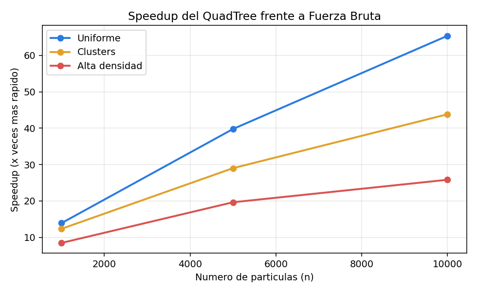
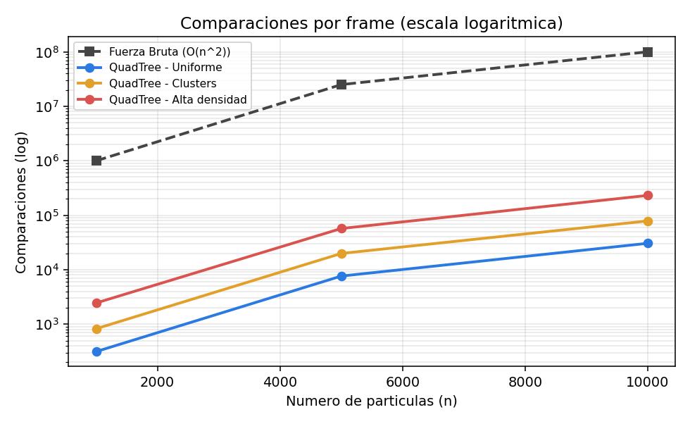

# Reporte experimental — QuadTree vs Fuerza Bruta

**Proyecto 2 · CS2023 — Algoritmos y Estructuras de Datos**
**Estructura asignada:** QuadTree (Opción A: Simulador de partículas 2D)
**Integrantes:** _[completar nombres]_

---

## 1. Objetivo

Demostrar empíricamente que un **QuadTree** resuelve la detección de colisiones/vecinos
cercanos entre partículas de forma más eficiente que la **solución ingenua** (fuerza bruta,
que compara todas las partículas contra todas). Se mide cómo cambia el rendimiento de ambos
métodos al aumentar el número de partículas y bajo distintas distribuciones espaciales.

## 2. Estructura y solución ingenua

- **QuadTree:** árbol cuaternario que particiona el plano. Cada nodo cubre una región; cuando
  acumula más de `c` partículas (capacidad), se subdivide en 4 cuadrantes. Para detectar
  colisiones, cada partícula consulta solo una pequeña ventana a su alrededor y compara
  únicamente contra los **candidatos** de esa región.
- **Fuerza bruta:** para cada partícula recorre todas las demás → `n·(n−1)` comparaciones por
  frame, es decir **O(n²)**, independientemente de la distribución.

(El detalle de invariantes, operaciones y complejidad está en `JUSTIFICACION.md`.)

## 3. Metodología

| Parámetro | Valor |
|---|---|
| Tamaños de entrada (n) | 1.000 · 5.000 · 10.000 partículas |
| Distribuciones | Uniforme · Clusters · Alta densidad |
| Frames promediados por caso | 15 |
| Capacidad por nodo | 4 |
| Radio de partícula | 3.0 |
| Velocidad máxima | 1.0 |
| Tamaño del mundo | 800 × 600 |
| Lenguaje / estándar | C++17 |
| Compilador | g++ (MSYS2 UCRT64) _[indicar versión: `g++ --version`]_ |
| Framework gráfico | Qt 6.11.0 |
| Build | CMake + Ninja |
| Sistema operativo | Windows _[versión]_ |
| CPU | _[completar: modelo del procesador]_ |
| RAM | _[completar]_ |

**Qué se mide en cada frame:** se mueven las partículas, se reconstruye el QuadTree
(midiendo su tiempo de construcción), y se ejecutan la fuerza bruta y el QuadTree midiendo
tiempo y número de comparaciones de cada uno. Los valores reportados son el **promedio** de
los 15 frames.

**Métricas reportadas:**
- `build(ms)`: tiempo de construcción del QuadTree por frame.
- `FB(ms/f)` y `QT(ms/f)`: tiempo promedio por frame de cada método.
- `comp.FB` y `comp.QT`: comparaciones promedio por frame de cada método.
- `cand/part`: candidatos revisados por partícula con el QuadTree (= comp.QT / n).
- `speedup`: cuántas veces más rápido es el QuadTree (FB(ms/f) / QT(ms/f)).

## 4. Resultados

> Tiempos en milisegundos. Promedio de 15 frames por caso.

### 4.1 Distribución uniforme

| n | build(ms) | FB(ms/f) | QT(ms/f) | comp.FB | comp.QT | cand/part | speedup |
|---:|---:|---:|---:|---:|---:|---:|---:|
| 1.000 | 0.193 | 2.991 | 0.215 | 999.000 | 314 | 0.31 | **13.89x** |
| 5.000 | 1.200 | 79.531 | 2.000 | 24.995.000 | 7.633 | 1.53 | **39.77x** |
| 10.000 | 2.896 | 368.248 | 5.632 | 99.990.000 | 30.473 | 3.05 | **65.38x** |

### 4.2 Distribución con clusters

| n | build(ms) | FB(ms/f) | QT(ms/f) | comp.FB | comp.QT | cand/part | speedup |
|---:|---:|---:|---:|---:|---:|---:|---:|
| 1.000 | 0.220 | 3.372 | 0.274 | 999.000 | 825 | 0.83 | **12.33x** |
| 5.000 | 1.475 | 86.333 | 2.977 | 24.995.000 | 19.859 | 3.97 | **29.00x** |
| 10.000 | 2.823 | 322.231 | 7.354 | 99.990.000 | 78.462 | 7.85 | **43.81x** |

### 4.3 Distribución de alta densidad

| n | build(ms) | FB(ms/f) | QT(ms/f) | comp.FB | comp.QT | cand/part | speedup |
|---:|---:|---:|---:|---:|---:|---:|---:|
| 1.000 | 0.224 | 3.113 | 0.369 | 999.000 | 2.451 | 2.45 | **8.45x** |
| 5.000 | 1.387 | 80.179 | 4.084 | 24.995.000 | 57.002 | 11.40 | **19.63x** |
| 10.000 | 2.846 | 321.989 | 12.474 | 99.990.000 | 230.874 | 23.09 | **25.81x** |

### 4.4 Gráficas

**Speedup en función de n** — la ventaja del QuadTree crece con el tamaño del problema:

**Comparaciones por frame (escala logarítmica)** — la fuerza bruta crece cuadráticamente
mientras el QuadTree se mantiene órdenes de magnitud por debajo:

## 5. Interpretación

**La fuerza bruta es exactamente cuadrática.** Las comparaciones (`comp.FB`) son idénticas en
las tres distribuciones para cada tamaño: 999.000, 24.995.000 y 99.990.000. Esto es
exactamente `n·(n−1)`, lo que confirma su complejidad **O(n²)**: no importa cómo estén
ubicadas las partículas, siempre compara todas contra todas.

**El QuadTree crece de forma casi lineal.** En distribución uniforme, las comparaciones del
QuadTree pasan de 314 a 30.473 al multiplicar n por 10. La clave está en `cand/part`, que se
mantiene bajo (0.31 → 3.05): cada partícula revisa solo un puñado de vecinos en lugar de
toda la población. Por eso el trabajo total escala aproximadamente con `n` y no con `n²`.

**El speedup aumenta con n.** En uniforme va de 13.9x (1.000) a 39.8x (5.000) hasta **65.4x**
(10.000). Cuanto mayor es el problema, mayor es la ventaja del QuadTree: ahí está la utilidad
real de la estructura, justo donde la fuerza bruta se vuelve impracticable (368 ms por frame
con 10.000 partículas implicaría menos de 3 FPS con solo la detección).

**Efecto de la distribución espacial.** El rendimiento del QuadTree sí depende de cómo estén
repartidas las partículas:

| Distribución | speedup @10.000 | cand/part @10.000 |
|---|---:|---:|
| Uniforme | 65.38x | 3.05 |
| Clusters | 43.81x | 7.85 |
| Alta densidad | 25.81x | 23.09 |

A mayor concentración, más candidatos por partícula y menor ventaja. En **alta densidad**
muchas partículas caen en la misma región: los nodos se saturan, el árbol subdivide más pero
la poda pierde eficacia, y cada partícula termina revisando ~23 candidatos en lugar de ~3.
Aun así, el QuadTree sigue siendo **~26x más rápido** que la fuerza bruta. Es el peor caso
para la estructura, pero ni siquiera ahí pierde frente a la solución ingenua.

**Costo de construcción.** El tiempo de construir el árbol (`build`) crece de forma lineal con
n (~0.2 → 1.3 → 2.8 ms) y es despreciable frente a lo que ahorra: reconstruirlo cada frame
(2.8 ms) cuesta mucho menos que una sola pasada de fuerza bruta (322–368 ms con 10.000
partículas). Por eso es rentable reconstruirlo en cada frame a pesar de que las partículas se
mueven.

## 6. Justificación de los tamaños elegidos

Se eligieron 1.000, 5.000 y 10.000 partículas (los sugeridos por el enunciado) porque cubren
el rango donde el comportamiento asintótico se hace evidente: con 1.000 la diferencia ya es
notable (≈14x) y con 10.000 la fuerza bruta realiza ~100 millones de comparaciones por frame,
volviéndose claramente impracticable en tiempo real, mientras el QuadTree se mantiene fluido.
Tamaños mayores fueron limitados por _[ajustar según su máquina: la capacidad de la CPU/RAM
para mantener la fuerza bruta en tiempos medibles dentro de la animación]_.

## 7. Conclusiones

- La fuerza bruta confirmó su complejidad **O(n²)** (comparaciones exactamente `n·(n−1)`,
  independientes de la distribución).
- El QuadTree mantiene un número casi constante de candidatos por partícula, escala de forma
  aproximadamente **lineal** y su ventaja **crece con n** (hasta 65x con 10.000 partículas en
  distribución uniforme).
- El rendimiento del QuadTree depende de la distribución espacial: rinde mejor cuando las
  partículas están dispersas y pierde eficacia (sin dejar de ganar) cuando se concentran.
- El costo de reconstruir el árbol cada frame es despreciable frente al ahorro en la
  detección, lo que valida la estrategia de reconstrucción por frame.
